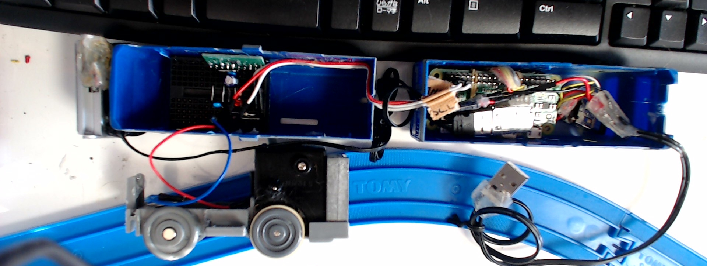

# プラレールの RaspBerry pi Zero による制御
## はじめに
Raspberry pi Zero を入手、使いみちとして真っ先に浮かんだのが、プラレールの制御でした。大きさを比べると確かにできそう。

我が家には大量のプラレールがあるし、RaspBerry pi Zero を使えば、ただプラレールをリモコンで発進と停止させるだけでなく、様々な機能を追加実装できそう。最近はやりの IoT というものの勉強もしたい。

ということで、ネット上の情報を参照しながら、プラレールの制御を実装してみました。
現在のところ以下のような機能を実装しています。

* Web ページからのモーター On/Off
* Bluetooth ヘッドセットからのボイスコマンドによるモータ On/Off
* プラレール搭載 Web カメラからの映像ストリーミング

以下、私の実装方法を紹介します。

## 概要 
以下機器の概要です。使用機器の型番などは、パーツリストをご参照ください。

### 車両について

車両は、JR EH-200 ブルーサンダーを採用しました。決め手は 3 両目でした。  
Raspberry pi Zero は自身の消費電流も高く、さらに USB、I2C などデバイスを増設し、さらにプラレールのモーターを動かすとなるとかなりの容量がバッテリーに求められます。これはかなり大きなバッテリーを積まないといけない。  
ブルーサンダーの 3 両目はコンテナを外すとただの台車となり、そこのバッテリーが載せられますので、採用しました。  

### ハウジング

  
もくろみ通り、すっぽりと収まっています。
左側車両は1両目、モーターとギアボックス、ブレッドボードに実装されたモーターコントローラーがぴったりプラレールに収まっています！また前方についているのは、Web カメラです。  
右側車輌には、Raspberry pi Zero と USB ハブ、Bluetooth Dongle と Wifi Dongleが収まっていま_main/_documents/Readme/imgす。先頭車両の Web カメラはここで Raspberry pi Zero に接続されています。

### 配線の実態
  
  
なるべくシンプルに収めるため、[こちら](https://www.hackster.io/fvdbosch/raspberry-pi-zero-usb-hub-mod-ec9e20)など参考に、USB Hub を直結しています。これ以外は特に凝った配線はしていません。  
ただし、接続部はしっかりとはんだ付けし、写真のようにホットグルーなどでしっかりと補強することをお勧めします。
接続部が弱ると、振動で電気的ノイズが発生し、Kernel Panic が頻発することがあります。

## 続きは
[Readme_Hardware.md](_main/_documents/Readme/ReadMe_Hardware.md) にて配線図などの説明をします。
[Readme_Software.md](_main/_documents/Readme/ReadMe_Software.md) にて機能の実装方法を説明します。

[EOF]