# プラレールの RaspBerry pi Zero による制御 - Hardware 編
## 配線図
これが全体配線図です。[AutoDesk の 123D Circuit](https://123d.circuits.io/circuits/2087376-kmori-raspberry-pi-zero-on-pla-rail-toy-train) で作成しました。
クリックして大きなサイズを確認できます。(2016/07/17 - 電源近くにパスコンデンサを追加しました。)
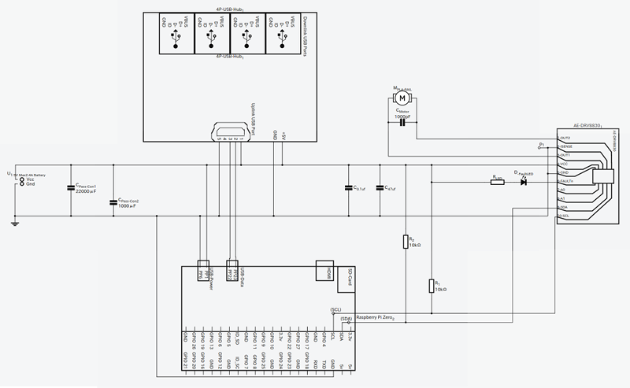](img/Diagram-Large.png)

## モータードライバーおよびモーター
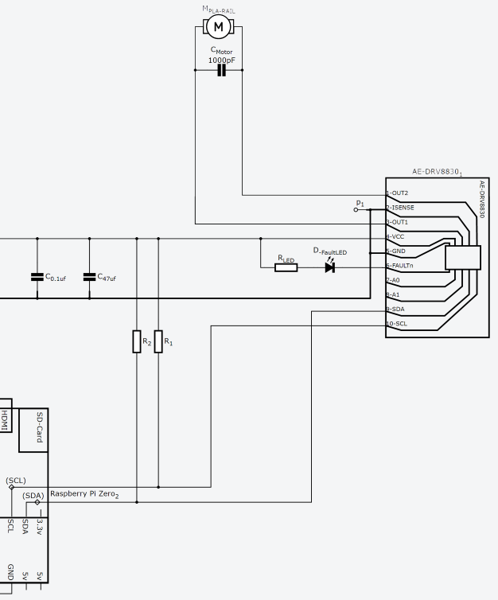
モータードライバーは秋月電子さんの [AE-DRV8300](<http://akizukidenshi.com/catalog/g/gK-06273/>) を使用しています。
I2C バスを使用しているので、Raspberry Pi 上の Linux から簡単に制御できます。
モーターは、プラレールのモーターになります。

モータードライバーと Raspberry pi Zero との接続には、GPIO pin の SDA/SCL と GND のみ使用しています。
VCC はモーターの駆動にも使用されています。Raspberry Pi 回路を通すと過電流と電圧低下が懸念されるので VCC はバッテリーから直接接続しています。
SCL/SDA はプルアップが必要なので、VCC から分岐し、抵抗 R1/R2（それぞれ10kΩ) を介して接続しています。
VCC と GND 間のコンデンサ、モーター端子間のコンデンサは、他製品の[説明書類](http://akizukidenshi.com/download/img/akizuki/AE-MOTOR8830_setsuzokurei.png)から確認しました。
電流検出は使わないので、ISENSE は GND とショートさせています。
OUT1 は、プラレールの＋極、OUT2 はプラレールの-極に接続しています。
回路はブレッドボードに実装し、以下のようになっています.
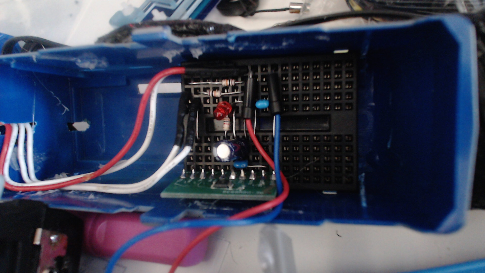

## USB Hub の接続
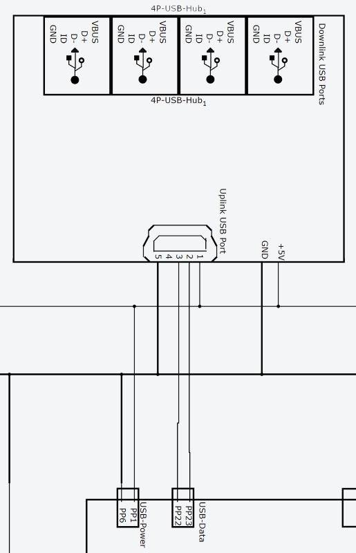
Raspberry Pi Zero は 増設できる USB ポートがひとつしかなく、そのままでは事実上何もできないので、USB ハブを増設します。省スペースで行うため、USB ハブは　Raspberry Pi Zero に直付けします。
USB ハブは[バッファローの BSH4A01 ](http://www.amazon.co.jp/iBUFFALO-%E3%80%90%E9%9B%BB%E6%BA%90%E9%80%A3%E5%8B%95%E3%82%BF%E3%82%A4%E3%83%97%E3%80%91-%E3%80%90PlayStation4-torne%E5%8B%95%E4%BD%9C%E7%A2%BA%E8%AA%8D%E6%B8%88%E3%80%91-BSH4AE06BK/dp/B005GYJSHG/ref=sr_1_2?s=computers&ie=UTF8&qid=1460821757&sr=1-2&keywords=BSH4A01
)を使用。こちらは、セルフパワー対応ながら、非常に小型です。
ケースを剥き、USB コネクタを外すと、以下のように、Raspberry Pi Zero より小さくなります。

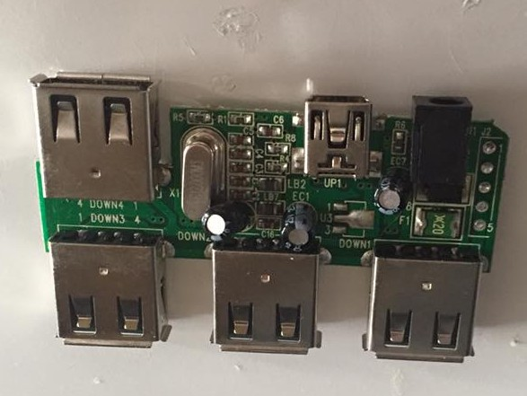
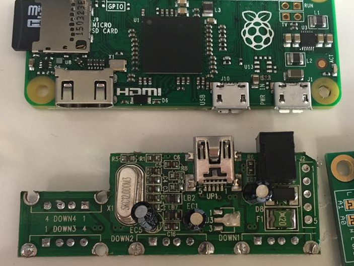

これを、Raspberry Pi Zero に接続します。
Raspberry Pi Zero には、各 I/O 関連の端子には裏に接点(Test Pad)が出ています。Test Pads については[こちら](http://hackers.gallery/841/misc/raspberry-pi-zero-pad-probing)などが参考になります。
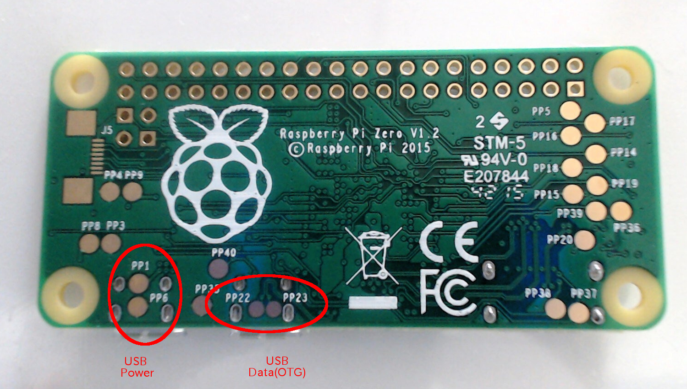
この内、USB Power（PP1,PP6） と、USB Data（PP22,PP23） を使って、Raspberry pi zero と USB ハブを接続できます。
親切なことに、取り付ける USB ハブには、Uplink 側コネクタの接点が出ています。

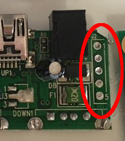

このため、Raspberry Pi Zero との接続にあたり、導線を小さな Mini USB コネクタ端子にハンダ付けする必要はありません。
接続する端子の対応は以下。なお、USB ハブのセルフ/バスパワー自動識別のためか、５V+ と GND も接続しなければ動作しませんでした。

| Raspberry | USB Hub |Assignment|
|-----------|---------|--------|
|PP1|Pin1|5V+|
|PP6|Pin５|GND|
|PP22|Pin3|D+|
|PP23|Pin2|D-|

また回路図にあるとおり、USB ハブの AC アダプタ接続部分についても、電源と接続しておきます。
以上で、USB ハブとの接続は完了です。
すべて接続し、ホットグルーで保護すると、以下のようになります。

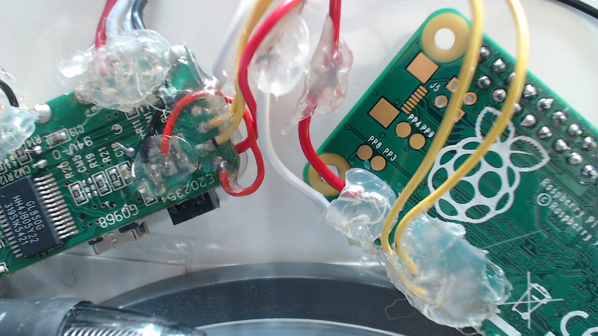

## 接続 USB 機器
増設した USB ハブに、USB コネクタを接続し、以下の機器を差し込んでいます。これで、Bluetooth,Wifi 通信が可能で、カメラが利用できる機器が完成です。設定等は別文書で説明します。

|機器    |メーカー|型番    |
|--------|--------|--------|
|Webカメラ|バッファロー|[BSW20KM03HSV](http://www.amazon.co.jp/iBUFFALO-WEB%E3%82%AB%E3%83%A1%E3%83%A9-200%E4%B8%87%E7%94%BB%E7%B4%A0-%E3%83%98%E3%83%83%E3%83%89%E3%82%BB%E3%83%83%E3%83%88%E4%BB%98-BSW20KM03HSV/dp/B0042D84BI?ie=UTF8&psc=1&redirect=true&ref_=oh_aui_search_detailpage)|
|Wifi Dongle|ELECOM|[WDC-150SU2MWH](http://www.yodobashi.com/ec/product/100000001002293238/index.html?_ga=1.101497288.897562664.1432822142)|
|Bluetooth Dongle |ELECOM|[LBT-UAN05C2](http://www.yodobashi.com/%E3%82%A8%E3%83%AC%E3%82%B3%E3%83%A0-ELECOM-LBT-UAN05C2-Bluetooth-Ver4-0-USB%E3%83%9B%E3%82%B9%E3%83%88%E3%82%A2%E3%83%80%E3%83%97%E3%82%BF%E3%83%BC/pd/100000001002154069/)|

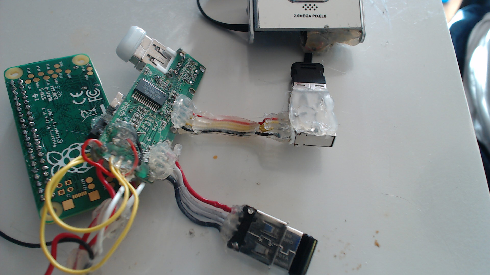

## パスコンデンサ
最後に電源近くに、パスコンデンサを追加しました。22000+1000 μF で合計 23000 = 23mF になります。
当初、操作中や走行中に、カーネルパニックを起こしがちでした。これは急激な消費電力の上昇による電圧降下によるものであったようです。
いろいろと試行錯誤した結果、すべての回路をひとつの能動素子と見立て、パススルーコンデンサを追加して、消費電力の上昇時の補償を行うことで、動作が安定しました。
現在の容量が適正かどうかはわかりませんが、とりあえず様子見です。
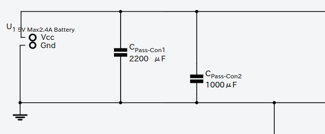
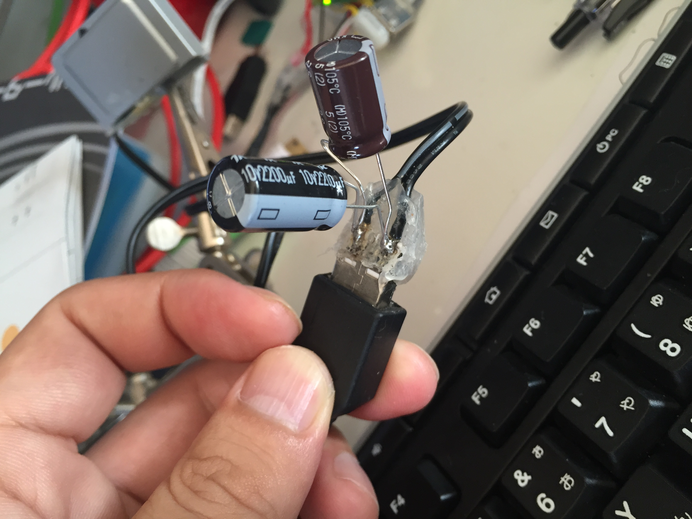
