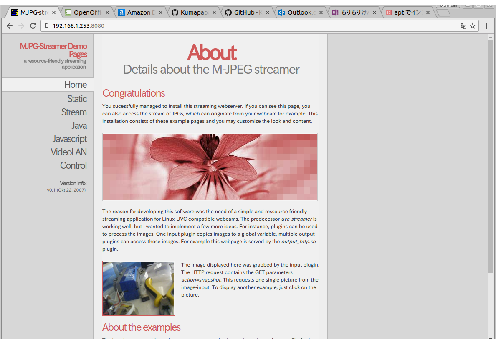

# プラレールの RaspBerry pi Zero による制御 - Software 編
## 概要

## OS のセットアップ
Raspberry Pi Zero で使用可能なオペレーティングシステムはいくつか選択肢がありますが、最終的に Jessie の Full Desktop Version としました。
Jessie は、PulseAudio 5 が標準ですが、このバージョンを使用すると、Bluetooth の HFP/HSP プロファイルが利用できません。このため、本当は、PulseAudio8 を使用する Ubuntu 16.04 の ARM 版を使用したかったのですが、Ubuntu の ARM サポートは、 ARM v7 以上。Raspberry Pi Zero の CPU は、ARMv6 ARM11 であるため、ブートさえしません。
仕方ないので、PulseAudio はソースからビルドすることにして、Jessie をセットアップします。
Jessie には、X-Window つきの Full Desktop Version "RASPBIAN JESSIE" と、X-Window 等を抜いて軽量化した "RASPBIAN JESSIE LITE" がありますが、Bluetooth を使おうとすると、X-Window が必須です。
したがって、使用 OS は、"RASPBIAN JESSIE" となりました。

ここから、"RASPBIAN JESSIE" をダウンロードし、SD に書き込みブートします。
https://www.raspberrypi.org/downloads/raspbian/

その後、最低限の以下の設定を行いました。

### raspi-config
まずはじめに、OS の基本設定を行います。
"sudo raspi-config" にて、Raspi-config を起動し以下の設定を行います。

	5. Internationalization Options
		Change TimeZone -> Asia/Tokyo
        Change Keyboard Layout -> Microsoft Natural/Other/Japanese/The default for.../No Compose Key
        Change Wifi Contry -> JP Japan
	9. Advanced Options
		SSH -> Enabled
		I2C -> Enabled

### Wifi Setting
固定 IP とするため、以下のファイルの設定を行いました。
下記 iface wlan0 以下を変更しています。
####/etc/network/interfaces
    # interfaces(5) file used by ifup(8) and ifdown(8)

    # Please note that this file is written to be used with dhcpcd
    # For static IP, consult /etc/dhcpcd.conf and 'man dhcpcd.conf'

    # Include files from /etc/network/interfaces.d:
    source-directory /etc/network/interfaces.d

    auto lo
    iface lo inet loopback

    iface eth0 inet manual

    allow-hotplug wlan0
    iface wlan0 inet static
        wpa-conf /etc/wpa_supplicant/wpa_supplicant.conf
        address	192.168.1.253
        network 192.168.1.0
        netmask 255.255.255.0
        broadcast 192.168.1.255
        gateway 192.168.1.1

## ソフトウェアその1 - Web Interaface
Web ページを開くと、スライドバーとビデオのスクリーンが出ます。
スライドバーで速度調整をしながら運転します。

### 使用するコンポーネントのインストール
１．nginx
Web サーバーです。このサーバー上で、 Web ページを公開します。
なお、 Apache でも問題ありません。
apt-get で普通にインストールします。

<PRE> apt-get install nginx
</PRE>

２．Node.js
モーターの制御を行うサービスを提供します。
Web Socket で ポート 10502 を使用しています。
クライアントはこのサービスに接続して、モーターの制御を行います。
こちらを参考に、インストールしました。

http://qiita.com/seibe/items/36cef7df85fe2cefa3ea

Web Socket と i2c-bus も合わせてインストールします。

<PRE>sudo apt-get install -y nodejs npm
sudo npm cache clean
sudo npm install n -g
sudo n stable
sudo ln -sf /usr/local/bin/node /usr/bin/node
node -v
sudo apt-get purge -y nodejs npm
## I2C と WebSocket 用コンポーネントのインストール
sudo npm install i2c-bus
sudo npm install ws
</PRE>

３．gcc などコンパイラ系
Mjpg streamer をインストールするために必要です。
Mjpg Streamer は Apt でインストールできるパッケージがありませんので、Raspberry pi zero 上でビルドするためにインストールします。

<PRE>sudo apt-get install subversion libjpeg-dev imagemagick
sudo apt-get install make cmake gcc
</PRE>

### MJpg-Streamer のビルドとインストール
以下を順次実施すれば、ビルドとインストールは完了です。
<PRE>wget https://github.com/jacksonliam/mjpg-streamer/archive/master.zip
unzip master.zip 
cd mjpg-streamer-master/mjpg-streamer-experimental/
make
sudo make install
</PRE>

テストのために一度起動します。

<PRE>mjpg_streamer -i "input_uvc.so -d /dev/video0 -y -n" -o "output_http.so -w /usr/local/share/mjpg-streamer/www/ -p 8080"
</PRE>

ブラウザで http://Localhost:8080/ を開き、こちらが表示されれば成功です。

次に、起動時の自動起動を設定します。
こちらのスクリプトを作成して配置します。root 特権を使用します。

#### /etc/systemd/system/mjpg-streamer.service
<PRE>[Unit]
Description = Movie Streaming
After=network.target

[Service]
ExecStart=/usr/local/bin/mjpg_streamer -i "input_uvc.so -d /dev/video0 -r 320x240 -f 30 -y -n" -o "output_http.so -w /usr/local/share/mjpg-streamer/www/ -p 8080"
Restart=always
User=%i
Type=simple

[Install]
WantedBy=multi-user.target
</PRE>

スクリプトができたら、下記のコマンドで、サービスを有効化します。

<PRE>sudo systemctl enable mjpg-streamer
</PRE>

以上で、起動時に mjpg-streamer が起動するようになります。
下記にて手動でサービスの起動と停止も可能です。

<PRE>sudo systemctl start mjpg-streamer
sudo systemctl stop mjpg-streamer</PRE>

### Web ページおよびスクリプトのセットアップ
1. 以下のフォルダ/ファイルをコピーします。
    ** フォルダ **
    "Pla-Rail-Startup"
    "bin"
    ==> /home/pi/ にコピーします。

    ** ファイル **
    "index.css"
    "index.html"
    ==> /var/www/html/ にコピーします。

2. .bashrc を編集します。
    /home/pi/.bashrc の末尾に以下を追加します。

    <PRE>export NODE_PATH=/usr/local/lib/node_modules
    NPM_PATH=/usr/local/bin/npm
    export PATH=/usr/local/bin:~/bin:$NPM_PATH:$NODE_PATH:$PATH

    find ~/Pla-Rail-Startup -type f -perm +111 | sort | bash &</PRE>

3. ~/Pla-Rail-Startup/01-Websock-Interface に実行権限を付与します。
	<PRE>chmod +x ~/Pla-Rail-Startup/01-Websock-Interface </PRE>
    
4. OS を再起動します。
	再起動後、Web ブラウザで http://(Raspberry pi zero IP Address)/ を開くと、操縦可能になります。
    操作の様子を、[Youtube に Up](https://youtu.be/m4cnAravc4Q) しました。
    <iframe width="420" height="315" src="https://www.youtube.com/embed/m4cnAravc4Q" frameborder="0" allowfullscreen></iframe>

## ソフトウェアその2 - Voice Command Interface
(作成中。。。)